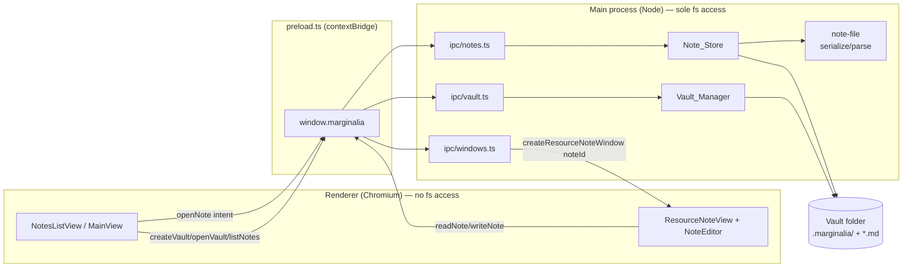

# Design Document: Vault and Notes

## Overview

This feature adds durable persistence to Marginalia. Today a resource note's state (title, prose, highlights) lives only in the renderer's React state and is lost when the window closes (see `ResourceNoteView.tsx`). We introduce a **vault** — a user-chosen folder that is the single source of truth for a collection of resource notes — and store each note as a single, human-readable file inside it.

The design follows three hard constraints from the requirements and the project's steering rules:

1. **Local accessibility and app-independence (Req 7).** Notes are stored as UTF-8 text that reads sensibly in any text editor, with no separate database. The vault folder is self-contained and relocatable.
2. **Extensible resource model (Req 4).** A resource note pairs a *resource* (a tagged/discriminated type) with *note content*. Only `website-link` is implemented; `pdf` and `video` are reserved so they can be added later without reworking storage.
3. **The established Marginalia architecture.** The renderer never touches the filesystem. All persistence flows through the single typed preload bridge: renderer → `window.marginalia.*` → `ipcRenderer.invoke` → `ipcMain.handle` in a domain module under `src/electron/ipc/`. Window creation stays in the main process.

### Storage format decision (the central question)

**Decision: one Markdown file per note, with YAML frontmatter for metadata, and the note prose serialized as Markdown in the body. No SQLite.** An OPTIONAL in-memory listing cache MAY be derived at open time, but it is never authoritative and is fully rebuildable from the folder.

Rationale, evaluated against the alternatives the user raised:

| Option | App-independent readability (Req 7.1) | Round-trip fidelity (Req 7.4) | Relocatable (Req 7.5) | Fit with existing Tiptap editor |
| --- | --- | --- | --- | --- |
| **Markdown + YAML frontmatter (chosen)** | Strong — prose reads as prose, metadata reads as a labeled block at the top | Good, with an explicit mapping for the custom `highlightQuote` node (below) | Yes — each file is self-contained | Tiptap ↔ Markdown needs a documented mapping; StarterKit maps cleanly to CommonMark |
| JSON sidecar (`.json` per note) | Weaker — prose becomes an escaped JSON string (`\n`, `\"`), awkward to read/edit by hand | Trivial (structural) but the prose itself is not "readable characters" in the spirit of Req 7.1 | Yes | Would store Tiptap JSON verbatim; easiest fidelity but least human-friendly |
| SQLite | Fails Req 7.1/7.2 — binary, not a text editor artifact, implies a database | N/A | Single file is portable but not "readable without the app" | Rejected |

Markdown-with-frontmatter is the strongest fit for the guiding constraint ("readable and meaningful on disk without the app"). Its one real cost — the custom `highlightQuote` node is not standard Markdown — is addressed with an explicit, reversible on-disk representation (see *Data Models → Tiptap ↔ Markdown mapping*). We do **not** introduce SQLite; the user's stated preference (folder as source of truth) is well-supported and no requirement compels a database.

Because Req 7.4 requires *equivalence*, not byte-identity, we take a deliberate approach: metadata (title, resource, highlight anchors) round-trips through structured YAML frontmatter — the reliable part — while the prose round-trips through a Tiptap→Markdown→Tiptap conversion whose equivalence is defined at the level of prose text content and highlight ordering (not raw byte identity of the Markdown). See the Correctness Properties section for the precise equivalence relation.

## Architecture

### Where new code lives

Following the "one file per feature domain" and process-separation conventions in the structure rules:

```
src/
  shared/
    resource-note.ts    # NEW  Resource (discriminated union), ResourceNote, NoteContent types
    ipc.ts              # EXTEND  add vault/notes methods to MarginaliaApi
  electron/
    ipc-channels.ts     # EXTEND  add Vault* / Notes* channels to IpcChannels enum
    preload.ts          # EXTEND  implement the new bridge methods
    ipc/
      vault.ts          # NEW  ipcMain.handle for vault create/open/current
      notes.ts          # NEW  ipcMain.handle for list/read/write notes
      index.ts          # EXTEND  register the two new handler groups
    vault/              # NEW folder  main-process filesystem logic (no Electron UI concerns)
      vault-manager.ts  # NEW  Vault_Manager: create/open/track Active_Vault, marker, path persistence
      note-store.ts     # NEW  Note_Store: enumerate/read/write Note_Files in the Active_Vault
      note-file.ts      # NEW  pure (de)serialization: ResourceNote <-> on-disk Markdown+frontmatter
      note-file.test-support.ts  # (optional) shared fixtures for tests
    windows/
      resource-note.ts  # EXTEND  accept an optional noteId/path to open an existing note
  ui/
    App.tsx             # EXTEND  MainView now hosts the notes list; route unchanged
    views/
      MainView.tsx      # EXTEND  render NotesListView (no-vault actions vs. notes list)
    components/
      notes/            # NEW feature folder  (per structure rule: add folders as features grow)
        NotesListView.tsx   # NEW
        NoteListItem.tsx     # NEW
        VaultEmptyState.tsx  # NEW  create/open actions when no vault active
```

A new `src/electron/vault/` folder is justified by the structure rules: it groups main-process, non-IPC, non-window filesystem logic (analogous to how `windows/` groups window factories and `ipc/` groups handlers). Keeping `Vault_Manager`, `Note_Store`, and the pure serialization in plain modules — separate from the thin IPC handlers that call them — keeps the handlers trivial and makes the serialization unit/property testable without Electron.

### IPC flow

The persistence path mirrors the existing pattern exactly. Example — listing notes when a vault opens:

```
NotesListView (renderer)
  → window.marginalia.listNotes()            (preload bridge, @shared/ipc)
  → ipcRenderer.invoke(IpcChannels.NotesList)
  → ipcMain.handle(NotesList) in ipc/notes.ts
  → NoteStore.list(activeVaultPath)          (src/electron/vault/note-store.ts)
  → returns ResourceNoteSummary[]            (back across the bridge)
```



### Active vault lifecycle and window fan-out

At most one vault is active at a time (Req 2.2). The `Active_Vault` path is main-process state held by `Vault_Manager`. Because notes open in separate windows that each need to know the active vault, and because the notes list must refresh when the active vault changes (Req 3.3), the active-vault change is broadcast to all windows over IPC — reusing the exact fan-out pattern already used for theme (`theme.ts` → `webContents.send`). A new `VaultChanged` main→renderer channel pushes `{ path, name } | null` so every open window (the launcher's notes list especially) updates within 1 second.

Persisting *which* vault was last active (so it can be reopened) is stored in Electron's `userData` directory as a small JSON settings file (`app.getPath('userData')/vault-state.json`). This is app-level state (a pointer to the last vault), **not** note data — it does not violate "no database for notes" (Req 7.2), since the vault folder remains the single source of truth for note content; this file only remembers a path. If the file is missing or the path no longer exists, the app boots with no active vault and shows the create/open actions (Req 3.2).

### Security posture (unchanged)

All new windows and the main window keep `contextIsolation: true`, `nodeIntegration: false`, and the shared preload. The renderer gains no direct `fs` or `path` access — only the new typed methods. The strict app CSP still exempts `<webview>` guests. Filesystem paths coming from the renderer as note identifiers are validated in the main process (the note id is resolved to a filename *within* the active vault; the renderer never passes raw absolute paths for reads/writes — see Error Handling → path safety).

## Components and Interfaces

### Shared types (`src/shared/resource-note.ts`)

The single source of truth for the persisted entity and its cross-process contract. Reuses the existing `Highlight` type from `@shared/highlight` unchanged (Req 4.6).

```ts
import type { Highlight } from '@shared/highlight';

/** Recognized resource variant identifiers (Req 4.2). */
export type ResourceType = 'website-link' | 'pdf' | 'video';

/** The only implemented variant (Req 4.3). */
export interface WebsiteLinkResource {
  type: 'website-link';
  /** http/https URL of the linked page; non-empty (validated on write). */
  url: string;
}

/**
 * Reserved future variants (Req 4.4). Declared so the union is closed and
 * exhaustive `switch` statements are future-proof, but NOT created or rendered
 * by the current implementation.
 */
export interface PdfResource { type: 'pdf'; /* reserved */ }
export interface VideoResource { type: 'video'; /* reserved */ }

/** Discriminated union keyed on `type` (Req 4.2). */
export type Resource = WebsiteLinkResource | PdfResource | VideoResource;

/**
 * The user-authored body: rich-text prose plus embedded highlights.
 * `prose` is the editor document serialized to Markdown (readable text, Req 7.3);
 * `highlights` is the ordered anchor list, kept alongside so anchors survive
 * even when the prose Markdown is hand-edited.
 */
export interface NoteContent {
  /** Tiptap document serialized to Markdown. */
  prose: string;
  /** Ordered clips; each is the existing @shared/highlight Highlight. */
  highlights: Highlight[];
}

/** A persisted resource note (Req 4.1). */
export interface ResourceNote {
  /** Stable, unique, immutable id (also the filename stem). */
  id: string;
  /** 0–255 chars; default applied on write if blank (Req 5.7). */
  title: string;
  resource: Resource;
  content: NoteContent;
  /** Epoch ms, set once on first write (Req 4.1, 5.4). */
  createdAt: number;
  /** Epoch ms, updated on every write/modification (Req 4.7, 5.4). */
  modifiedAt: number;
}

/** Lightweight row for the notes list (avoids loading full prose, Req 3). */
export interface ResourceNoteSummary {
  id: string;
  title: string;
  resourceType: ResourceType;
  modifiedAt: number;
}

/** Discriminated result type so IPC returns errors as data, not exceptions. */
export type Result<T> =
  | { ok: true; value: T }
  | { ok: false; error: VaultError };

export interface VaultError {
  code:
    | 'no-vault'            // Req 5.6
    | 'not-a-vault'         // Req 2.3
    | 'vault-unreadable'    // Req 2.4
    | 'write-failed'        // Req 5.5
    | 'note-not-found'      // Req 6.4
    | 'note-unreadable'     // Req 6.7
    | 'unknown-resource-type' // Req 4.5
    | 'marker-create-failed'; // Req 1.7
  message: string;
  /** Present where the error concerns a specific note/file. */
  noteId?: string;
  file?: string;
}
```

Rationale for `Result<T>` over thrown errors: several requirements demand that an error be *returned* while state is left unchanged (Req 1.7, 2.3, 2.4, 4.5, 5.5, 6.4). Modeling errors as data across the IPC boundary makes those "leave-unchanged, return-error" contracts explicit and testable, and avoids leaking raw Node error objects to the renderer.

### `MarginaliaApi` additions (`src/shared/ipc.ts`)

```ts
export interface MarginaliaApi {
  // ...existing getAppVersion / openResourceNoteWindow / theme methods...

  /** Prompt for a folder and designate it a vault; sets it active (Req 1). */
  createVault: () => Promise<Result<VaultInfo | null>>; // null = user cancelled (Req 1.6)
  /** Prompt for an existing vault folder and open it (Req 2). */
  openVault: () => Promise<Result<VaultInfo | null>>;   // null = user cancelled (Req 2.5)
  /** The current active vault, or null if none (for boot + display, Req 2.6). */
  getActiveVault: () => Promise<VaultInfo | null>;
  /** Subscribe to active-vault changes (fan-out); returns an unsubscribe (Req 3.3). */
  onVaultChanged: (cb: (vault: VaultInfo | null) => void) => () => void;

  /** List summaries in the active vault, most-recently-modified first (Req 3.1, 6.1). */
  listNotes: () => Promise<Result<ResourceNoteSummary[]>>;
  /** Read one full note by id (Req 6.3). */
  readNote: (id: string) => Promise<Result<ResourceNote>>;
  /** Write (create or overwrite in place) a note (Req 5). Returns the note with updated timestamps. */
  writeNote: (note: ResourceNoteInput) => Promise<Result<ResourceNote>>;
  /** Ask the main process to open a note in a resource-note window (Req 3.6). */
  openNoteWindow: (id: string) => Promise<Result<void>>;
}

export interface VaultInfo {
  /** Absolute filesystem path (for display, Req 2.6). */
  path: string;
  /** Folder basename, shown as the vault name. */
  name: string;
}

/** Input shape for writes: caller supplies content; timestamps are set by the store. */
export type ResourceNoteInput = Pick<
  ResourceNote, 'id' | 'title' | 'resource' | 'content'
>;
```

`onVaultChanged` mirrors the existing `onThemeChanged` bridge implementation (wrap the listener, return a disposer).

### `IpcChannels` additions (`src/electron/ipc-channels.ts`)

```ts
export enum IpcChannels {
  // ...existing...
  VaultCreate = 'vault:create',
  VaultOpen = 'vault:open',
  VaultGetActive = 'vault:get-active',
  VaultChanged = 'vault:changed',        // main → renderer broadcast
  NotesList = 'notes:list',
  NoteRead = 'notes:read',
  NoteWrite = 'notes:write',
  OpenNoteWindow = 'window:open-note',
}
```

### Vault_Manager (`src/electron/vault/vault-manager.ts`)

Owns the active-vault path, the marker, and last-active-vault persistence. Pure main-process module (no renderer, no dialog UI beyond the Electron `dialog` call).

```ts
class VaultManager {
  /** Show folder dialog, create marker, set active (Req 1.1–1.7). */
  create(): Promise<Result<VaultInfo | null>>;
  /** Show folder dialog, verify marker, set active (Req 2.1–2.6). */
  open(): Promise<Result<VaultInfo | null>>;
  /** Current active vault (Req 2.6), or null. */
  getActive(): VaultInfo | null;
  /** Restore last-active vault on boot from userData (best-effort). */
  restore(): Promise<VaultInfo | null>;
  /** Internal: recognize a folder as a vault by its marker (Req 1.3, 2.2). */
  isVault(dir: string): Promise<boolean>;
}
```

Behavior notes:
- **Dialog:** uses `dialog.showOpenDialog` with `properties: ['openDirectory']` (and `['createDirectory']` on create). Cancel returns `{ ok: true, value: null }` — a cancel is *not* an error (Req 1.6, 2.5).
- **Create on existing vault (Req 1.4):** if the chosen folder already has a marker, adopt it without overwriting contents (skip marker re-creation).
- **Marker write failure (Req 1.7)** and **not-a-vault / unreadable marker (Req 2.3, 2.4)** return the corresponding `VaultError` and leave the active vault unchanged.
- **On success**, sets active, persists the path to `userData/vault-state.json`, and triggers the `VaultChanged` broadcast (implemented in `ipc/vault.ts`, which owns `webContents` fan-out like `ipc/theme.ts`).

### Note_Store (`src/electron/vault/note-store.ts`)

Reads and writes `Note_File`s in the active vault. Delegates all (de)serialization to the pure `note-file.ts` so it can be tested against a temp directory.

```ts
class NoteStore {
  /** Enumerate readable notes as summaries, newest-first; skip unreadable (Req 6.1, 6.2, 6.7). */
  list(vaultPath: string): Promise<Result<ResourceNoteSummary[]>>;
  /** Read one note by id; unknown-type and not-found are errors (Req 4.5, 6.3, 6.4). */
  read(vaultPath: string, id: string): Promise<Result<ResourceNote>>;
  /** Write atomically; create-or-overwrite-in-place; set timestamps (Req 5). */
  write(vaultPath: string, note: ResourceNoteInput): Promise<Result<ResourceNote>>;
}
```

Behavior notes:
- **Atomic write (Req 5.5):** write to a temp file in the same directory, then `rename` over the target. If any step fails, the previous file is left byte-for-byte unchanged and a `write-failed` error is returned.
- **Timestamps (Req 5.4):** on write, `modifiedAt` = clock at write start; on first write (no existing file for that id) `createdAt` = same value; on overwrite, `createdAt` is read from the existing file and preserved.
- **Default title (Req 5.7):** if the input title is empty/whitespace, substitute a default (`"Untitled note"`) and persist that.
- **Fault isolation on list (Req 6.7):** a file that fails to parse is skipped (excluded from the list, left on disk unmodified) and surfaced via a separate diagnostics channel in the result (see Error Handling); the remaining notes still load. This is a per-file try/catch inside the enumeration loop, not an all-or-nothing read.
- **Unknown resource type (Req 4.5):** if a note's frontmatter `type` is not a recognized identifier, `read` returns `unknown-resource-type` (naming the value) and does not modify the file; `list` skips it as unreadable and reports it.

### note-file (`src/electron/vault/note-file.ts`) — pure serialization

The heart of Req 7.4. Two pure functions with no I/O, so they are directly property-testable:

```ts
/** ResourceNote -> on-disk file string (UTF-8 Markdown + YAML frontmatter). */
export function serializeNote(note: ResourceNote): string;
/** file string -> ResourceNote, or a parse/validation error. */
export function parseNote(raw: string, id: string): Result<ResourceNote>;
```

The Tiptap document ↔ Markdown conversion (including the custom `highlightQuote` node) is described in *Data Models* below. Note that the *prose* Markdown conversion runs in the **renderer** when producing `NoteContent.prose` for a write, and when hydrating the editor on read — the editor and its schema live in the renderer. `note-file.ts` treats `prose` as an opaque Markdown string it embeds in / extracts from the file body; it owns the frontmatter and the file envelope only. This keeps `note-file.ts` free of any Tiptap dependency (main process) and keeps the schema-aware conversion where the schema is.

### Notes_List_View (renderer)

`MainView` currently is the launcher. It becomes the host of the notes list:

- **No active vault (Req 3.2):** render `VaultEmptyState` with "Create Vault" and "Open Vault" buttons wired to `window.marginalia.createVault()` / `openVault()`.
- **Active vault:** render `NotesListView`, which calls `listNotes()` and shows one `NoteListItem` per note, newest-first (Req 3.1), each showing the title (or a placeholder when blank/whitespace, Req 3.5) and a website-link type indicator (Req 3.4). Empty vault shows an empty-state message (Req 3.7).
- **Vault change (Req 3.3):** subscribe via `onVaultChanged`; on change, re-fetch the list and clear selection within 1s (the fetch is a single IPC round-trip, well within budget).
- **Open a note (Req 3.6):** clicking an item calls `openNoteWindow(id)`. On failure (Req 3.8) the list stays as-is and an inline error message is shown; the list is not replaced.

The theme toggle and version currently in `MainView` are retained (moved into the list header/footer).

### ResourceNoteView loading & saving

`ResourceNoteView` gains a note identity. The resource-note window URL is extended so the main process can open either a fresh note (existing `?url=`) or an existing note (`?noteId=`):

- **Open existing (Req 6.3, 6.5):** on mount, if `noteId` is present, call `readNote(id)`. Populate title, resource URL (drives the `<webview src>`), hydrate the editor from `content.prose` (Markdown → Tiptap document), and set `highlights` from `content.highlights`. The existing repaint effect (`paint(highlights)` on `ready`) re-anchors clips on the live page automatically; clicking a highlight scrolls to it when its text-quote anchor is found (Req 6.5).
- **Highlights that can't be re-anchored (Req 6.6):** the annotator's `paint`/`scrollTo` already tolerate anchors not found on the page. The design adds a visible indication: `paint(list)` is extended (guest side already returns which ids painted, or we compare) so the view marks un-anchored highlights in the `HighlightsIndex` (e.g. a muted "not found on page" badge) while retaining them in the note and prose. No highlight is dropped.
- **Saving:** debounced autosave. Title, editor `onUpdate`, and highlight-set changes mark the note dirty; a debounced (e.g. 800 ms idle) `writeNote(...)` persists it. The write returns updated `createdAt/modifiedAt`, which the view stores. A fresh note gets its `id` generated once on first save (reuse the existing `makeId()` idea; the id becomes the filename stem). Because Req 5.1 budgets 2 s for up to 1,000,000 chars and writes are atomic, autosave never blocks typing (the write is async in the main process).

## Data Models

### On-disk Note_File format

- **Location:** `<vault>/notes/<id>.md` (one Markdown file per note). Keeping notes in a `notes/` subfolder keeps the vault root tidy and separates them from the `.marginalia/` marker.
- **Encoding:** UTF-8 text (Req 7.1).
- **Structure:** a YAML frontmatter block (metadata) delimited by `---`, followed by the note prose as Markdown (Req 7.3). Frontmatter is used because it is the de-facto readable metadata convention for Markdown notes and is trivially separable from prose.

#### Frontmatter schema

```yaml
id: string            # matches filename stem; stable/immutable (Req 4.1)
title: string         # 0–255 chars as stored (default applied if blank, Req 5.7)
resource:
  type: website-link  # ResourceType discriminator (Req 4.2)
  url: https://…      # present for website-link (Req 4.3)
created: 1717000000000    # epoch ms (Req 4.1, 5.4)
modified: 1717000500000   # epoch ms (Req 4.7, 5.4)
highlights:               # ordered; each preserves all Highlight fields (Req 4.6, 7.4)
  - id: h-abc
    text: "the exact quoted text"
    prefix: "…preceding context"
    suffix: "following context…"
    url: https://…
    createdAt: 1717000100000
```

#### Concrete example (`notes/note-2024-earthquake.md`)

```markdown
---
id: note-2024-earthquake
title: Charleston earthquake notes
resource:
  type: website-link
  url: https://en.wikipedia.org/wiki/1886_Charleston_earthquake
created: 1717000000000
modified: 1717000500000
highlights:
  - id: h-1a2b
    text: "one of the most powerful earthquakes to hit the Eastern United States"
    prefix: "The earthquake was "
    suffix: ", causing severe damage"
    url: https://en.wikipedia.org/wiki/1886_Charleston_earthquake
    createdAt: 1717000100000
---

# Aftermath

The event reshaped local building codes.

> [!highlight id=h-1a2b]
> one of the most powerful earthquakes to hit the Eastern United States

This quote anchors my argument about seismic risk in the region.
```

Everything here is legible in a plain text editor: the metadata is a labeled block, the prose is prose, and each clip appears inline as a readable blockquote (Req 7.1, 7.3).

### Tiptap document ↔ on-disk Markdown mapping

The editor uses `StarterKit` plus the custom `highlightQuote` node. The mapping:

- **StarterKit prose** (paragraphs, headings, bold/italic, lists, blockquotes, code) ↔ standard CommonMark. This is a well-trodden conversion; we use a Markdown serializer/parser for the ProseMirror schema (e.g. `prosemirror-markdown`, or `tiptap-markdown` which wraps it) configured with the editor's schema. This runs in the renderer where the schema is defined.
- **The custom `highlightQuote` node** is the only non-standard element. It is an atomic block with attributes `{ id, text, url }`. We map it to a **GitHub-style highlighted blockquote directive** so it stays readable *and* reversible:

  ```markdown
  > [!highlight id=h-1a2b]
  > <the highlight text, verbatim>
  ```

  - **Serialize (Tiptap → Markdown):** emit a blockquote whose first line is the marker `[!highlight id=<id>]` and whose remaining lines are the highlight `text`. The `url` is *not* duplicated here — it is already stored structurally in the frontmatter `highlights` array keyed by the same `id`, which is the authoritative anchor record. This avoids two sources of truth for a highlight's metadata.
  - **Parse (Markdown → Tiptap):** a blockquote whose first line matches `^\[!highlight id=(\S+)\]` becomes a `highlightQuote` node; its `id` comes from the marker, its `text` from the remaining blockquote lines, and its `url` is resolved by looking up the id in the parsed frontmatter `highlights`. A blockquote *without* the marker parses as a normal blockquote (StarterKit).

  Rationale: the frontmatter `highlights` array is the source of truth for anchor context (`prefix`/`suffix`/`url`/`createdAt`) — the fields the annotator needs to re-find the clip. The inline directive carries only what must live *in the prose* to preserve reading order and the clickable block: the id (to rejoin with the anchor) and the visible quoted text. This split is what makes the round trip robust: prose Markdown can be hand-edited without losing anchors, and the anchor record can be read without parsing prose.

- **Empty document:** serializes to an empty body (just the frontmatter block + trailing newline); parses back to an empty Tiptap doc.

This mapping is deliberately designed so the *equivalence* in Req 7.4 holds: title and resource round-trip through YAML; the ordered highlight set (with full anchor context) round-trips through the frontmatter array; and the prose text content plus the order and identity of embedded highlights round-trip through the Markdown body. See Correctness Properties for the precise statement.

### Vault marker

- **Marker:** a `.marginalia/` directory at the vault root containing a `vault.json` file:

  ```json
  { "marginaliaVault": true, "version": 1 }
  ```

  A directory-based marker (rather than a single dotfile) leaves room for future derived artifacts (e.g. the optional listing cache) without cluttering the vault root, and is easy to recognize (Req 1.3, 2.2). Recognition = "`.marginalia/vault.json` exists and parses with `marginaliaVault: true`".
- **Recognition failures:** missing marker → `not-a-vault` (Req 2.3); marker present but unreadable/malformed → `vault-unreadable` (Req 2.4).
- **Optional listing cache (non-authoritative):** if listing performance becomes a concern, a `.marginalia/index.json` MAY cache summaries. It is strictly derived: on any mismatch, missing entry, or absence it is rebuilt by enumerating `notes/*.md`. The folder is always the source of truth (Req 7.2); the cache is never read as authoritative and its loss never loses data.

### Last-active-vault pointer (app state, not note data)

`app.getPath('userData')/vault-state.json`:

```json
{ "lastVaultPath": "/Users/me/Documents/MyVault" }
```

Read once on boot to restore the active vault; ignored if the path no longer exists or is no longer a vault.

## Correctness Properties

*A property is a characteristic or behavior that should hold true across all valid executions of a system — essentially, a formal statement about what the system should do. Properties serve as the bridge between human-readable specifications and machine-verifiable correctness guarantees.*

The serialization core (`note-file.ts`) and the store logic (`note-store.ts`, `vault-manager.ts`) are pure/near-pure with clear input→output behavior, which makes property-based testing a strong fit. The properties below were derived from the acceptance-criteria prework and consolidated to remove redundancy (several fidelity criteria — 4.6, 5.2, 6.3, 7.3 — collapse into the single round-trip property).

### Property 1: Note serialization round-trip preserves the note

*For any* valid `ResourceNote`, reading back the serialized file (`parseNote(serializeNote(note), note.id)`) yields a `ResourceNote` equivalent to the original, where equivalence means: the `title` string, the `resource` (including `type` and `url`), the prose text content, and the ordered list of highlights — each preserving its `id`, `text`, `prefix`, `suffix`, `url`, and `createdAt` — are all identical.

**Validates: Requirements 7.4, 4.6, 5.2, 6.3, 7.3**

### Property 2: Relocation invariance

*For any* vault containing a set of notes, copying the entire vault folder to a different filesystem location and opening it there produces a note list identical (same ids and note content) to the list produced at the original location, requiring no data outside the copied folder.

**Validates: Requirements 7.5**

### Property 3: Notes are listed most-recently-modified first

*For any* set of persisted notes, the list produced by the store contains exactly one summary per readable note and is ordered by `modifiedAt` descending.

**Validates: Requirements 3.1, 6.1**

### Property 4: Per-file fault isolation on load

*For any* vault whose files partition into parseable notes and unparseable files, listing returns exactly the parseable notes (newest-first), leaves every unparseable file byte-for-byte unchanged on disk, and surfaces a diagnostic identifying each excluded file. (The all-unparseable and empty cases yield an empty list with no error.)

**Validates: Requirements 6.7, 6.2**

### Property 5: Unrecognized resource type is a non-destructive error

*For any* note file whose `resource.type` is not one of the recognized identifiers (`website-link`, `pdf`, `video`), reading it returns an `unknown-resource-type` error whose message includes the offending `type` value, and the file's bytes on disk are left unchanged.

**Validates: Requirements 4.5**

### Property 6: Opening a missing id is a non-destructive error

*For any* active vault and *any* identifier not present among its notes, a read for that id returns a `note-not-found` error and leaves the vault and all its note files unchanged.

**Validates: Requirements 6.4**

### Property 7: Empty/whitespace titles are stored as the default

*For any* title string consisting only of whitespace (including the empty string), writing the note persists the non-empty default title, and reading the note back returns that default title.

**Validates: Requirements 5.7**

### Property 8: Write sets timestamps correctly

*For any* note, the first write sets `createdAt` and `modifiedAt` both equal to the write-start clock; *for any* subsequent overwrite of the same id, `createdAt` is preserved from the existing file and `modifiedAt` is set to the (later) write-start clock.

**Validates: Requirements 5.4, 4.7**

### Property 9: Overwrite is in place (one file per id)

*For any* note, writing it and then writing it again under the same id results in exactly one note file for that id in the vault (no duplicate file is created).

**Validates: Requirements 5.3**

### Property 10: Failed writes leave the prior file byte-unchanged

*For any* already-persisted note, if a write fails (e.g. the final commit step errors), the previously written file remains byte-for-byte unchanged and the result is a `write-failed` error naming the affected note id.

**Validates: Requirements 5.5**

### Property 11: Designate-then-recognize round-trip

*For any* writable folder, after it is designated a vault, recognizing that folder as a vault succeeds (the marker persists and is readable).

**Validates: Requirements 1.2, 1.3**

### Property 12: Opening a valid vault sets it as the sole active vault

*For any* prior active-vault state (a vault or none) and *any* valid vault folder, opening the valid folder makes it the active vault and leaves at most one vault active.

**Validates: Requirements 2.2**

### Property 13: Opening an invalid vault folder errors without changing state

*For any* folder that is not a recognizable, readable vault (no marker, or a malformed/unreadable marker), opening it returns an error (`not-a-vault` or `vault-unreadable` respectively) and leaves the current active vault unchanged.

**Validates: Requirements 2.3, 2.4**

## Error Handling

Errors are returned as data via the `Result<T>` type rather than thrown across the IPC boundary, so the "return an error and leave state unchanged" contracts (Req 1.7, 2.3, 2.4, 4.5, 5.5, 6.4) are explicit and testable. The renderer pattern-matches on `result.ok`.

| Situation | Requirement | Handling |
| --- | --- | --- |
| User cancels folder dialog | 1.6, 2.5 | Return `{ ok: true, value: null }` — a cancel is not an error; active vault unchanged. |
| Chosen folder unwritable / marker can't be created | 1.7 | `marker-create-failed`; active vault unchanged. |
| Opened folder has no marker | 2.3 | `not-a-vault`; active vault unchanged. |
| Marker present but unreadable/malformed | 2.4 | `vault-unreadable`; active vault unchanged. |
| Save with no active vault | 5.6 | `no-vault`; no file created. |
| Write fails mid-commit | 5.5 | Atomic write (temp file + rename); prior file untouched; `write-failed` with note id. |
| Read a note whose `type` is unrecognized | 4.5 | `unknown-resource-type` naming the value; file unchanged. |
| Open a note id that no longer exists | 6.4 | `note-not-found`; vault and files unchanged. |
| A single file won't parse during list | 6.7, 6.2 | Skip that file (per-file try/catch), leave it on disk, include it in a `diagnostics` array on the successful result; other notes load. |
| Highlight anchor not found on live page | 6.6 | Prose still restored; highlight retained and flagged "not found on page" in the index; nothing dropped. |
| Opening the note window fails | 3.8 | `openNoteWindow` returns an error; the list stays unchanged and shows an inline error. |

**Non-fatal diagnostics on list:** `listNotes` returns `{ ok: true, value: summaries, diagnostics?: VaultError[] }` so a partly-corrupt vault still succeeds (Req 6.7) while telling the user which files were skipped. (The `diagnostics` field is additive on the success branch; failures still use the `ok: false` branch.)

**Path safety:** the renderer identifies notes by opaque `id`, never by absolute path. The main process resolves `id` to `<vault>/notes/<id>.md` and rejects ids that would escape the notes directory (path traversal guard), so a malicious or buggy renderer cannot read/write outside the active vault. This upholds the process-separation and least-privilege posture in the steering rules.

## Testing Strategy

There is **no test framework configured** in this repo today (per the tech steering: no `npm test`, no runner). This feature is the first to warrant one. Recommendation: add **Vitest** (fast, TS-native, ESM-friendly, works well for the pure Node modules here) with **fast-check** for property-based testing. Both are dev-only and do not touch the packaged app. A `test` script (`vitest run`) would be added to `package.json`. This is a proposal for the tasks phase — no runner is assumed to already exist.

### Dual approach

- **Property tests (fast-check, ≥100 iterations each)** cover the universal properties above. The prime targets are the pure serialization (`note-file.ts`) and the store logic (`note-store.ts`, `vault-manager.ts`) exercised against OS temp directories. Each property test is tagged with a comment referencing its design property, e.g.:

  ```ts
  // Feature: vault-and-notes, Property 1: Note serialization round-trip preserves the note
  ```

  - Generators: a `ResourceNote` arbitrary producing website-link resources with valid http/https urls, 0–255-char titles (including whitespace-only, covering Req 4.3/5.7 edge cases), prose with the full StarterKit node mix, and ordered highlight arrays with arbitrary text/prefix/suffix (covering unicode, empty context). Prose text content is compared after normalizing, since Markdown round-trips text and structure but not byte-identical formatting — the equivalence relation in Property 1 is defined at the prose-text + highlight-order level, not raw bytes.
  - Fault injection (Properties 4, 10): a thin fs seam (or `mock-fs`/spies) to force parse/write failures for specific files.

- **Unit / example tests** cover the concrete scenarios and error paths that are not universal: dialog invocation and cancel (Req 1.1, 1.6, 2.1, 2.5 — mock `dialog`), adopt-existing-vault-on-create (Req 1.4), no-vault-on-save (Req 5.6), and the resource-type union being closed (Req 4.2, 4.4).

- **Renderer / UI tests** (example-based, React Testing Library under Vitest + jsdom): the notes list conditional states — no-vault actions (Req 3.2), empty state (Req 3.7), title placeholder for whitespace (Req 3.5), type indicator (Req 3.4), open-failure inline error (Req 3.8), and vault-change refresh clearing selection (Req 3.3). These are UI rendering assertions, not properties.

- **Integration tests (1–3 examples, not PBT)** cover behavior that depends on the live `<webview>` and OS dialog and does not vary meaningfully with input: clicking a restored highlight scrolls the page (Req 6.5) and the not-found indication surfaces (Req 6.6). These are inherently environment-dependent; a small number of representative cases is the right tool, not property testing.

### Performance checks (informal)

Req 5.1 (write ≤2 s for ≤1,000,000 chars) and Req 3.3 (list refresh ≤1 s) are performance bounds, not properties. They are verified with a couple of timed example tests / manual checks rather than property tests, since 100 iterations add no coverage over a single large-payload measurement.

### Why PBT applies here (and where it doesn't)

The persistence layer is exactly where PBT shines: `serializeNote`/`parseNote` are pure functions with a classic round-trip law, and the store operations have clear invariants (ordering, file-count, non-destructive errors) over a large input space (arbitrary prose, titles, highlight sets, note collections). The UI rendering and the live-webview/dialog integration points are deliberately excluded from PBT — they are covered by example and integration tests as noted, consistent with the "when PBT is not appropriate" guidance.
